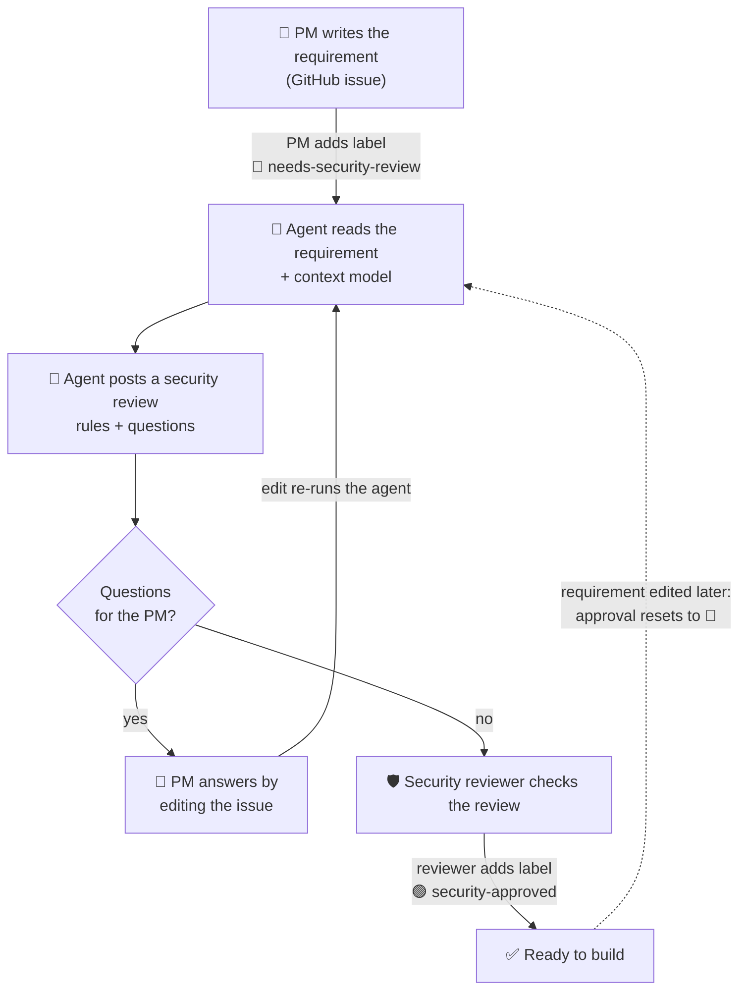
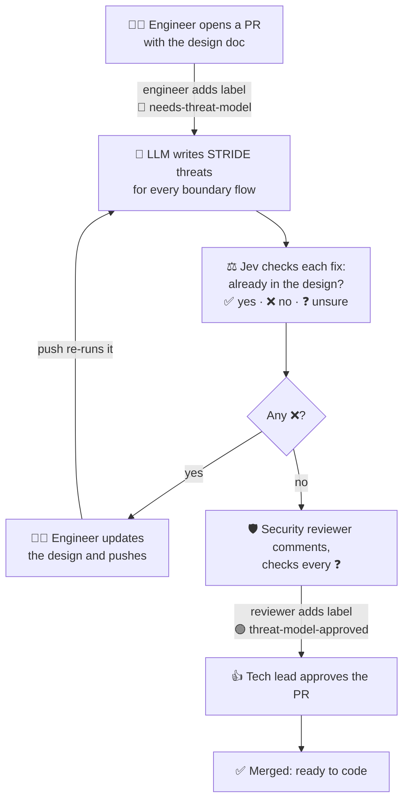
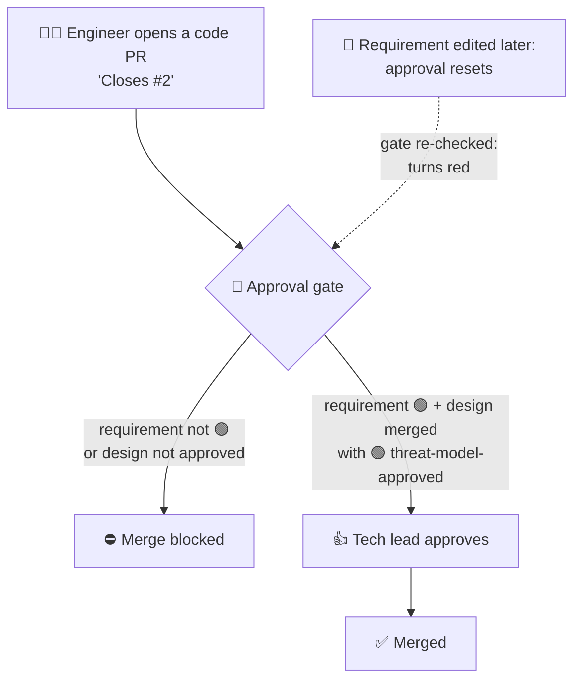
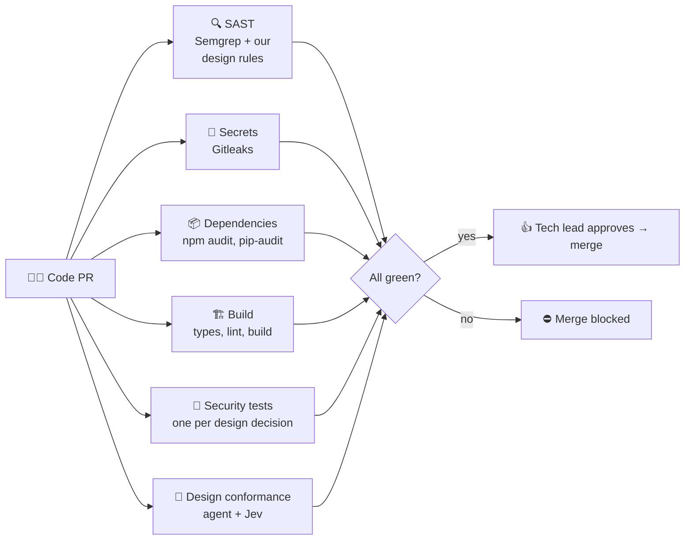

# agentic-secure-sdlc

A hands-on lab for an **agentic security workflow across the SDLC**, built one stage at a time and
following the order a feature takes: requirement, design, code, CI, release, production.

## What is built so far

| Built | What it does | JD line |
|---|---|---|
| **Security context model** | One YAML file of the product's security facts: data sensitivity, roles, rules, limits. Every step reads it. Changing it is a security change: the ₹50,000 second-approver limit went through a design PR, a threat model and sign-off (PR #4). | "Own the product security context model" |
| **Stage 1: requirement review** | An LLM step turns a requirement (GitHub issue) into security acceptance criteria. A human reviewer signs off. | requirements, human-review requirements |
| **Stage 2: threat model** | An LLM writes STRIDE threats for every boundary-crossing flow in the design; **Jev** judges whether each fix is already in the design. A human reviewer signs off. | threat modeling, validate agent outputs |
| **Label-driven flow** | Labels trigger each step; only collaborators can add them; comments never trigger anything. | human-review points, escalation |
| **Sign-off rules** | Approval labels only count from a listed security reviewer who has commented on the latest review. Any change resets approval. | decision rules, release governance |
| **Merge gates** | A ruleset on `main`: a design PR needs its threat model approved; a code PR needs its requirement and design approved; every PR needs the tech lead's approval. | release gates |
| **Guardrails** | Least-privilege tokens, untrusted input treated as data, PR code never run, kill switch (`AGENT_ENABLED=false`), model pinned, every revision kept. | least privilege, prompt-injection handling, kill switch, audit |
| **Checks on the model** | Code verifies every boundary flow was analysed; the model that writes threats never grades them. | evaluation, false-positive tuning |

## The scenario

**Rupi-yeah** is an **expense reimbursement app** that other companies use: their employees submit
expense claims, their managers approve them, and approved claims are reimbursed.

## Who does what

| Role | Played by | Does |
|---|---|---|
| Repo owner and **security reviewer** | `padmanabhan-r` | Owns the security context model. Reviews the agent's criteria and signs off by adding `security-approved`. The only account allowed to approve (repo variable `SECURITY_REVIEWERS`). |
| **Product Manager** | `paddy-codes` | Writes requirements as GitHub issues, answers questions by editing the issue body, and adds `needs-security-review` to ask for a review. |
| **Tech lead** | `paddy-codes` | Gives the engineering approval on design and code PRs: does it work, is it maintainable. (The lab has two accounts, so paddy-codes plays both PM and tech lead.) |
| **Security agent** | `github-actions[bot]` | Reads the requirement and the context model and posts advisory security criteria. Never approves anything. |
| **Engineer** | `padmanabhan-r` | Writes the design and, later, the code, as pull requests. In a real team this is a different person from the security reviewer; in the lab one account plays both, and never approves its own work. |
| Employee and Manager | test data | The product's users, at the customer company. They appear as sample users once there is code. |

## Stage 1: requirement → security acceptance criteria

**The two labels drive everything:**

| Label | Who adds it | What it triggers |
|---|---|---|
| 🔴 `needs-security-review` | PM | The agent reviews the requirement. While it is on, every edit to the issue re-runs the agent. |
| 🟢 `security-approved` | Security reviewer only | Sign-off. The agent stops. Removed again if anyone else adds it, or if the reviewer has not first posted a review comment after the latest security review. |

Comments never trigger the agent, and it never reads them. An edit by someone who is not a collaborator
still resets the approval, but does not re-run the agent.

## Stage 2: design → threat model

Stage 1 asked **what the feature must do**. Stage 2 asks **how the design could be attacked**.
A threat model needs a design, so the engineer writes one first.

### Threat modelling in four questions

| # | Question | What you produce |
|---|---|---|
| 1 | What are we building? | A **data-flow diagram**: components, the arrows data moves along, and the **trust boundaries** (where data crosses from less trusted to more trusted, e.g. internet → our API) |
| 2 | What can go wrong? | **STRIDE** on every arrow that crosses a trust boundary |
| 3 | What will we do about it? | A mitigation for each threat |
| 4 | Did we do a good job? | A security reviewer checks and signs off |

**STRIDE**: six ways things go wrong. Ask each one of every boundary-crossing arrow.

| | Threat | Ask |
|---|---|---|
| **S** | Spoofing | Can someone pretend to be someone else? |
| **T** | Tampering | Can someone change the data on the way? |
| **R** | Repudiation | Can someone deny they did it? |
| **I** | Information disclosure | Can someone see data they should not? |
| **D** | Denial of service | Can someone make it unavailable? |
| **E** | Elevation of privilege | Can someone do more than their role allows? |

### For our feature

The design is [`docs/design/expense-approval.md`](docs/design/expense-approval.md): 7 components and
7 data flows. **Four flows cross a trust boundary, and that is where the threats are:**

| Flow | From → To | Why it matters |
|---|---|---|
| F1 | Browser → Identity provider | Logging in: stolen passwords, fake login pages |
| F2 | Browser → Approvals API | Every approve and reject goes through here |
| F5 | Browser → Receipt storage | Receipts and bank statements: personal data |
| F7 | Approvals API → Bank payout service | Real money leaves Rupi-yeah |

### The flow

**Two models, two jobs.** The LLM (`gpt-5.4-mini`) writes the threats. **Jev**, TypeSafe AI's decision
model, judges whether each fix is already in the design and returns a probability. The model that wrote
a threat never grades it: when it did, it marked missing fixes as covered. Jev is fast (under a second)
and cheap (about $0.00004 per threat model), and anything it is unsure about goes to the reviewer.

**Code checks the model.** Code reads the design's table of boundary-crossing flows and checks that
every one appears in the threat model. If one is missing, it retries once, then says "Not analysed"
rather than hiding it. Each revision also gets the previous threat model and the reviewer's comments.

**The two labels, on the design PR:**

| Label | Who adds it | What it triggers |
|---|---|---|
| 🔴 `needs-threat-model` | Engineer | The threat model is drafted. While it is on, every new commit re-drafts it. |
| 🟢 `threat-model-approved` | Security reviewer only | Sign-off, after the reviewer has commented on the latest threat model. Otherwise removed. |

**A PR cannot merge into `main` until** (ruleset "main: security gates"):
- the status check `security/threat-model` is green: it stays red on a design PR until 🟢 is on, and
- the tech lead has approved the PR (1 approving review).

The repo admin can bypass the ruleset. GitHub logs every bypass.

Every re-run posts a new revision at the bottom of the PR. Older revisions stay, collapsed, so the whole
history is on record.

**Status: done.** PR #3: threat model Revision 5, reviewed and approved by the security reviewer
(two items accepted as risk for v1, to fix before general availability), approved by the tech lead,
merged. The design is on `main`.

## Stage 3: code → approval gate

Development means product code under `rupi-yeah/`. It can only reach `main` once its requirement and its
design have both been approved.

**The gate is code, not an LLM.** It sets the required status check `security/approval-gate`:

| The PR... | Gate |
|---|---|
| changes nothing under `rupi-yeah/` | ✅ not development |
| changes product code but has no "Closes #N" | ⛔ link the requirement |
| closes a requirement without 🟢 `security-approved` | ⛔ |
| closes a requirement with no merged, 🟢 `threat-model-approved` design ("Refs #N") | ⛔ |
| everything approved | ✅ |

If a requirement's approval is reset after the PR opened, the requirements flow re-checks every open PR
that closes it, and the gate turns red again. Code can be written any time; it cannot ship early.

**Status:** the gate is built, and the app's PR #5 passes it.

## Stage 4: the code security gate

Before code reaches `main`, every security feature in the design must be proven in the code. The gate
checks in layers, cheapest and most certain first; the LLM comes last.

| # | Check (required on `main`) | What it proves | Status |
|---|---|---|---|
| 1 | `sast` | No injection or unsafe patterns. Includes **our own rules written from the design**: every server action checks the CSRF token, identity never comes from the request, no HTML from data, cookies use the secure options (`security/semgrep/rupi-yeah.yml`). | ✅ built |
| 2 | `secrets` | No keys or tokens in any commit of the PR | ✅ built |
| 3 | `dependencies` | No known-vulnerable packages. It found one on day one: `requests` 2.32.5 (PYSEC-2026-2275), now 2.33. | ✅ built |
| 4 | `build` | Types, lint and production build pass | ✅ built |
| 5 | security tests | Each design decision as a test that fails if the code stops enforcing it | next |
| 6 | API checks | Every endpoint identifies the caller, rejects bad input, leaks nothing | next |
| 7 | design conformance | An agent with tools finds the code that enforces each design decision; Jev judges it | next |

This workflow runs the PR's own code, so it uses `pull_request` with a read-only token and no secrets.

## What is where

| Path | What it is |
|---|---|
| `security/context/rupi-yeah.yaml` | The product security context model: data sensitivity, roles, rules, limits. Owned by the security reviewer (`.github/CODEOWNERS`). |
| `agents/requirements_agent.py` | The requirements agent and the flow above |
| `.github/workflows/requirements-review.yml` | Runs the flow on issue events |
| `docs/design/` | Designs, one per feature. Input to the threat model. |
| `agents/threat_model_agent.py` | The threat-model step and its flow |
| `.github/workflows/threat-model.yml` | Runs it on design PR events |
| `agents/approval_gate.py`, `.github/workflows/approval-gate.yml` | The Stage 3 approval gate |
| `.github/workflows/code-security.yml`, `security/semgrep/` | The Stage 4 code security gate |
| `rupi-yeah/` | The Rupi-yeah app (Next.js), with its `PRODUCT.md` and `DESIGN.md` |
| Repo secrets | `OPENAI_API_KEY` (threats and criteria), `OPENROUTER_API_KEY` (Jev) |
| Repo variables | `SECURITY_REVIEWERS` (who may approve), `AGENT_ENABLED` (kill switch) |
| Ruleset "main: security gates" | Required checks `security/threat-model`, `security/approval-gate`, `sast`, `secrets`, `dependencies`, `build`, plus 1 approving review |

## Stages

| Stage | SDLC step | Status |
|---|---|---|
| 1 | Requirement → security acceptance criteria, using the context model | ✅ done: issue #2 |
| 2 | Design → threat model (STRIDE + Jev) | ✅ done: PR #3 |
| 3 | Code → approval gate; the Rupi-yeah app (Next.js) | ✅ built: app in PR #5 |
| 4 | Code security gate: SAST, secrets, dependencies, build, security tests, design-conformance agent | 🔨 layers 1–4 done |
