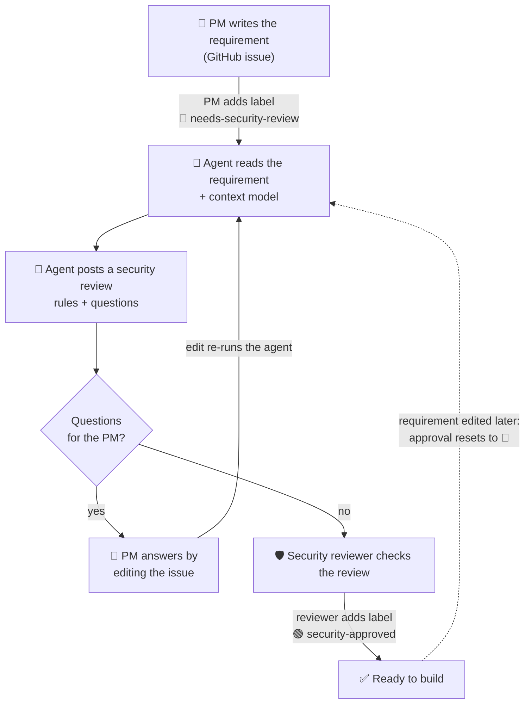
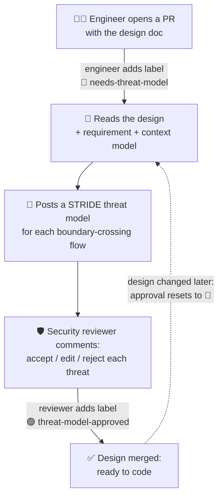

# agentic-secure-sdlc

A hands-on lab for an **agentic security workflow across the SDLC**, built one stage at a time and
following the order a feature takes: requirement, design, code, CI, release, production.

## The scenario

**Rupi-yeah** is an **expense reimbursement app** that other companies use: their employees submit
expense claims, their managers approve them, and approved claims are reimbursed.

## Who does what

| Role | Played by | Does |
|---|---|---|
| Repo owner and **security reviewer** | `padmanabhan-r` | Owns the security context model. Reviews the agent's criteria and signs off by adding `security-approved`. The only account allowed to approve (repo variable `SECURITY_REVIEWERS`). |
| **Product Manager** | `paddy-codes` | Writes requirements as GitHub issues, answers questions by editing the issue body, and adds `needs-security-review` to ask for a review. |
| **Security agent** | `github-actions[bot]` | Reads the requirement and the context model and posts advisory security criteria. Never approves anything. |
| **Engineer** | `padmanabhan-r` | Writes the design and, later, the code, as pull requests. In a real team this is a different person from the security reviewer; in the lab one account plays both, and never approves its own work. |
| Employee and Manager | test data | The product's users, at the customer company. They appear as sample users once there is code. |

## Stage 1: requirement → security acceptance criteria

**The two labels drive everything:**

| Label | Who adds it | What it triggers |
|---|---|---|
| 🔴 `needs-security-review` | PM | The agent reviews the requirement. While it is on, every edit to the issue re-runs the agent. |
| 🟢 `security-approved` | Security reviewer only | Sign-off. The agent stops. Removed again if anyone else adds it, or if the reviewer has not first posted a review comment after the latest security review. |

Comments never trigger the agent, and it never reads them. An edit by someone who is not a collaborator
still resets the approval, but does not re-run the agent.

## Stage 2: design → threat model

Stage 1 asked **what the feature must do**. Stage 2 asks **how the design could be attacked**.
A threat model needs a design, so the engineer writes one first.

### Threat modelling in four questions

| # | Question | What you produce |
|---|---|---|
| 1 | What are we building? | A **data-flow diagram**: components, the arrows data moves along, and the **trust boundaries** (where data crosses from less trusted to more trusted, e.g. internet → our API) |
| 2 | What can go wrong? | **STRIDE** on every arrow that crosses a trust boundary |
| 3 | What will we do about it? | A mitigation for each threat |
| 4 | Did we do a good job? | A security reviewer checks and signs off |

**STRIDE**: six ways things go wrong. Ask each one of every boundary-crossing arrow.

| | Threat | Ask |
|---|---|---|
| **S** | Spoofing | Can someone pretend to be someone else? |
| **T** | Tampering | Can someone change the data on the way? |
| **R** | Repudiation | Can someone deny they did it? |
| **I** | Information disclosure | Can someone see data they should not? |
| **D** | Denial of service | Can someone make it unavailable? |
| **E** | Elevation of privilege | Can someone do more than their role allows? |

### For our feature

The design is [`docs/design/expense-approval.md`](docs/design/expense-approval.md): 7 components and
7 data flows. **Four flows cross a trust boundary, and that is where the threats are:**

| Flow | From → To | Why it matters |
|---|---|---|
| F1 | Browser → Identity provider | Logging in: stolen passwords, fake login pages |
| F2 | Browser → Approvals API | Every approve and reject goes through here |
| F5 | Browser → Receipt storage | Receipts and bank statements: personal data |
| F7 | Approvals API → Bank payout service | Real money leaves Rupi-yeah |

### The flow

**Status:** the design PR is open. The threat-model step (🤖) is next to build.

## What is where

| Path | What it is |
|---|---|
| `security/context/rupi-yeah.yaml` | The product security context model: data sensitivity, roles, rules, limits. Owned by the security reviewer (`.github/CODEOWNERS`). |
| `agents/requirements_agent.py` | The requirements agent and the flow above |
| `.github/workflows/requirements-review.yml` | Runs the flow on issue events |
| `docs/design/` | Designs, one per feature. Input to the threat model. |

## Stages

| Stage | SDLC step | Status |
|---|---|---|
| 1 | Requirement → security acceptance criteria, using the context model | ✅ done: issue #2 |
| 2 | Design → threat model (STRIDE) | 🔨 in progress: design PR open |
| 3 | Code → build gate: a PR merges only if its requirement is approved | next |
| 4 | PR security agent: the first real agent, with tools | later |
