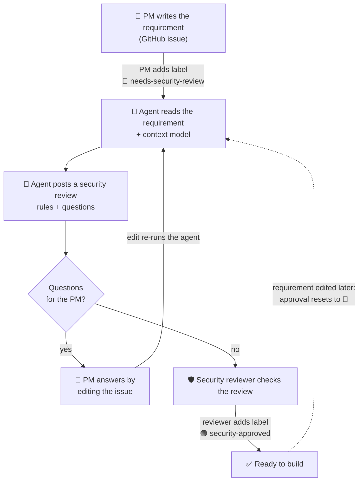

# agentic-secure-sdlc

A hands-on lab for an **agentic security workflow across the SDLC**, built one stage at a time and
following the order a feature takes: requirement, design, code, CI, release, production.

## The scenario

**Acme** builds an **expense reimbursement product** that other companies use: their employees submit
expense claims, their managers approve them, and approved claims are reimbursed.

## Who does what

| Role | Played by | Does |
|---|---|---|
| Repo owner and **security reviewer** | `padmanabhan-r` | Owns the security context model. Reviews the agent's criteria and signs off by adding `security-approved`. The only account allowed to approve (repo variable `SECURITY_REVIEWERS`). |
| **Product Manager** | `paddy-codes` | Writes requirements as GitHub issues, answers questions by editing the issue body, and adds `needs-security-review` to ask for a review. |
| **Security agent** | `github-actions[bot]` | Reads the requirement and the context model and posts advisory security criteria. Never approves anything. |
| Engineer | not yet | Builds the feature once the requirement is approved. |
| Employee and Manager | test data | The product's users, at the customer company. They appear as sample users once there is code. |

## Stage 1: the requirements flow

**The two labels drive everything:**

| Label | Who adds it | What it triggers |
|---|---|---|
| 🔴 `needs-security-review` | PM | The agent reviews the requirement. While it is on, every edit to the issue re-runs the agent. |
| 🟢 `security-approved` | Security reviewer only | Sign-off. The agent stops. Removed again if anyone else adds it, or if the reviewer has not first posted a review comment after the latest security review. |

Comments never trigger the agent, and it never reads them. An edit by someone who is not a collaborator
still resets the approval, but does not re-run the agent.

## What is where

| Path | What it is |
|---|---|
| `security/context/expense-reimbursement.yaml` | The product security context model: data sensitivity, roles, rules, limits. Owned by the security reviewer (`.github/CODEOWNERS`). |
| `agents/requirements_agent.py` | The requirements agent and the flow above |
| `.github/workflows/requirements-review.yml` | Runs the flow on issue events |

## Stages

| Stage | SDLC step | Status |
|---|---|---|
| 1 | Requirement → security acceptance criteria, using the context model | done: issue #1 |
| 2 | Code → the feature is built from the approved requirement | next |
