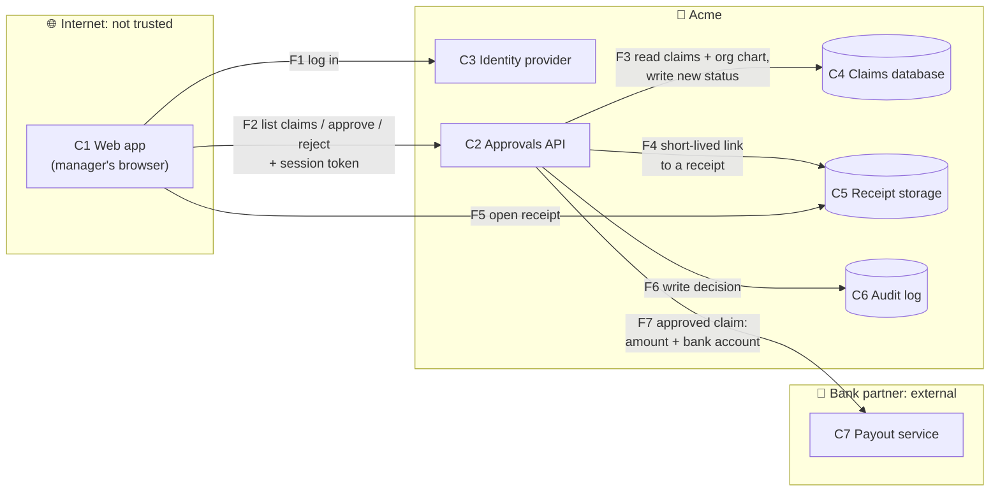

# Design: managers approve their team's expense claims

**Requirement:** #2 (security-approved) · **Author:** engineer · **Status:** draft

## What we are building

A manager opens the approvals page, sees pending claims from their direct reports, and approves or
rejects each one. Claims over 1,000 USD then go to a second approver. Approved claims go to the payout
service, which pays the employee.

## Components

| # | Component | What it is | Who runs it |
|---|---|---|---|
| C1 | Web app | The page in the manager's browser | The user's device: **not trusted** |
| C2 | Approvals API | Checks who the caller is and what they may do, then changes the claim | Acme |
| C3 | Identity provider | Logs users in and issues session tokens | Acme (single sign-on) |
| C4 | Claims database | Claims, their status, the org chart (who reports to whom) | Acme |
| C5 | Receipt storage | Receipt images and payment proof | Acme (object storage) |
| C6 | Audit log | Append-only record of every decision | Acme |
| C7 | Payout service | Sends money to the employee's bank account | **External** bank partner |

## Data flows

| Flow | From → To | Carries | Crosses a trust boundary? |
|---|---|---|---|
| F1 | Web app → Identity provider | Username, password, then a session token | **Yes**: internet → Acme |
| F2 | Web app → Approvals API | Session token, claim ID, approve/reject, comment | **Yes**: internet → Acme |
| F3 | Approvals API → Claims database | Claim reads, status writes | No |
| F4 | Approvals API → Receipt storage | Request for a short-lived download link | No |
| F5 | Web app → Receipt storage | The download link, then the receipt image | **Yes**: internet → Acme |
| F6 | Approvals API → Audit log | Who, what, when, before and after | No |
| F7 | Approvals API → Payout service | Amount, employee bank account | **Yes**: Acme → external |

## Key decisions

1. **Every rule is checked in C2, on the server,** for every request: direct reports only, no
   self-approval, pending status only, the 1,000 USD second-approver rule. The web app only hides buttons.
2. **The caller's identity comes from the session token, never from the request body.** C2 ignores
   any user ID the browser sends.
3. **Receipts are never served through C2.** C2 hands out a link that expires in 5 minutes and is
   issued only to someone allowed to see that claim.
4. **The decision and its audit record are written in one transaction.** A decision without an audit
   record cannot exist.
5. **Only C2 can reach C7,** over mutual TLS, and only for claims in "Ready for reimbursement".
